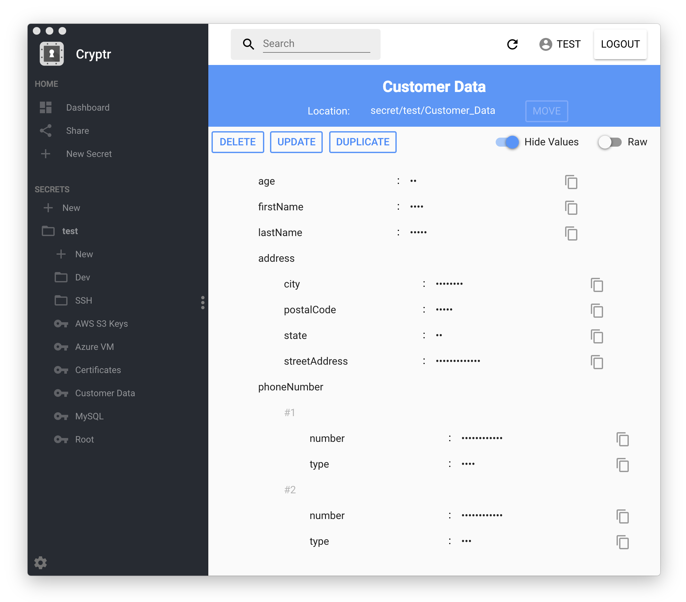

# Cryptr
Cryptr is a GUI for [Hashicorp's Vault](https://www.vaultproject.io/).

Using Cryptr, a user may easily interact with their Vault instance's API, reading, creating, and modifying secrets with ease.



## Download Binaries

Current release can be [downloaded here](https://github.com/jcrowthe/cryptr/releases).
Cryptr supports Windows, Linux and Mac OS. It has been tested on Windows 10, Ubuntu 16.04 Desktop, and macOS 10.12 Sierra.


## Building from Source

```
git clone https://github.com/jcrowthe/cryptr.git
cd cryptr
npm install
npm run dev
```

# Fun Features

In addition to the feature-set of Vault, Cryptr adds some things that are "nice to have". Some of these include:
- Secrets can be files
- Underscores in key names show as whitespace. ie. `secret/My_cool_Secret` shows up in the folder structure as `My cool Secret`
- Ability to move secrets.

### License
Apache 2.0 License

### HTTPS
Cryptr will ONLY access Vault servers enabled with HTTPS. These are your secrets. Keep them secret, keep them safe.

### Auth backends
Currently LDAP, UserPass and Token auth backends are accepted. Most others are not useful for a GUI, but if you feel otherwise, submit a pull request.


# Important Notes about Policies
## Secret Discovery

Cryptr requires the policies associated with the token to be readable by the token. The purpose for this is to discover what secrets are available to the token. An example ACL for policy found at `sys/policy/allsecrets` would be as follows:


```
path "secret/mysecrets/*" {
  policy = "write"
}

path "sys/policy/allsecrets" {
    policy = "read"
}
```

Only the permission to `read` is advised. **NOTE: This policy addition is _critical_ to discovering available secrets.** Without this, there is no programatic way for Cryptr to know what secrets it should show the user. (Also, for that matter, there is no way for a human using the CLI to discover secrets either except for blinding attempting to `list` potential folders) As such, it is **highly** recommended to do this for all policies. All policies without this ability must, and will, be ignored by Cryptr.

## Wildcards and Secret Discovery

Wildcards in path names are supported. However, there is a caveat that is best described with an example. Take the following policy as an example, understanding it being the only policy applied in this example:

```
path "secret/myteam*" {
  policy = "write"
}
```

With this policy, a user may create secrets such as `secret/myteam-keys` or `secret/myteam/certs`. This is absolutely accepted in Vault, however without an additional policy, neither Cryptr nor a human being on the CLI will be able to *discover* any of these secrets. This is because there is no containing folder upon which to execute a `list` command. The natural next step, then, would be to make an addition to the policy, as follows:

```
path "secret/myteam*" {
  policy = "write"
}

path "secret/*" {
  policy = "list"
}
```

But this is _not_ recommended for multiple reasons (the above being one obvious reason). Noted [here](https://www.vaultproject.io/docs/concepts/policies.html#list), `list` command outputs are not filtered by policy. This means all secrets found at `secret/*` will be listed, regardless if the token has rights to use any of them.

As such, the recommended procedure for using wildcards in policies is to not use prefixes and suffixes in the path. ie:

```
#GOOD
path "secret/myteam/*" {
  policy = "write"
}

#BAD
path "secret/group*" {
  policy = "write"
}

#BAD
path "secret/*group" {
  policy = "write"
}

```